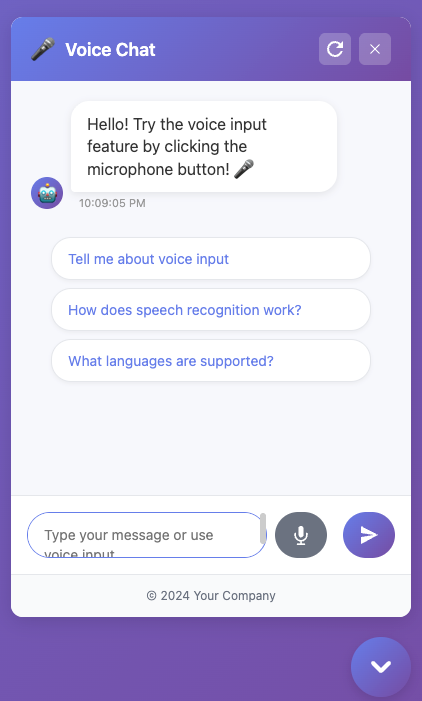

# 💬 Free Chat UI

[](https://github.com/importsource/free-chatui/releases)
[](https://github.com/importsource/free-chatui/blob/main/LICENSE)
[](https://github.com/importsource/free-chatui/stargazers)
[](https://github.com/importsource/free-chatui/network)
[](https://github.com/importsource/free-chatui/issues)
[](https://cdn.jsdelivr.net/gh/importsource/free-chatui@v1.0.0-alpha/n8n-chat.js)
[](https://github.com/importsource/free-chatui)

A modern, customizable chat widget for N8N workflows with advanced features including voice input, file upload, and comprehensive theming options.



## 🌐 Official Website

**👉 [Visit the Official Website](https://importsource.github.io/free-chatui/)**

Experience the live demo, explore all features, and see comprehensive examples on our official website.

## 📊 Project Status

| Status | Description |
|--------|-------------|
| 🚀 **Version** | v1.0.0-alpha |
| 📦 **CDN** | Available via jsDelivr |
| 🐛 **Issues** | [Report bugs](https://github.com/importsource/free-chatui/issues) |
| 💡 **Features** | [Request features](https://github.com/importsource/free-chatui/issues/new) |
| 📖 **Docs** | [View documentation](https://importsource.github.io/free-chatui/) |
| 💬 **Discussions** | [Join the conversation](https://github.com/importsource/free-chatui/discussions) |

## 🎯 Quick Links

- 📖 **[Live Demo](https://importsource.github.io/free-chatui/)** - See it in action
- 📚 **[Documentation](docs.html)** - Complete guide
- 🚀 **[Quick Start](#-quick-start)** - Get started in 5 minutes
- 🎨 **[Examples](#-examples)** - See all features
- 🤝 **[Contributing](#-contributing)** - Help improve the project
- 💝 **[Support](#-support)** - Show your support

## ✨ Features

- 🎤 **Voice Input** - Speech-to-text with audio recording
- 📁 **File Upload** - Support for images, documents, and audio files
- 🎨 **Advanced Theming** - Complete customization of colors, fonts, and layout
- 📱 **Responsive Design** - Works perfectly on desktop and mobile
- 🔧 **Embedded Mode** - Integrate directly into your website
- 💬 **Starter Prompts** - Guide users with helpful conversation starters
- 👋 **Welcome Messages** - Customizable greeting messages
- 🖼️ **Avatar Support** - Custom user and bot avatars
- 📄 **Footer Customization** - Add copyright and branding
- ⚡ **Quick Setup** - Get started in just 5 lines of code

## 🚀 Quick Start

```html
<!-- Include the chat widget -->
<script src="https://cdn.jsdelivr.net/gh/importsource/free-chatui@v1.0.0-alpha/n8n-chat.js"></script>

<script>
// Configure the chat widget
const N8N_CHAT_CONFIG = {
  chatUrl: 'https://your-n8n-webhook-url',
  placeholder: 'Type a message...',
  title: 'Chat Support',
  theme: {
    primaryColor: '#007bff',
    backgroundColor: '#ffffff'
  },
  voice: {
    enabled: true
  },
  fileUpload: {
    enabled: true,
    uploadUrl: 'https://your-upload-endpoint',
    downloadUrl: 'https://your-download-endpoint'
  }
};

// Initialize the chat widget
const chatWidget = new N8NChatUI(N8N_CHAT_CONFIG);
chatWidget.init();
</script>
```

## 📚 Documentation

- [📖 Complete Documentation](docs.html)
- [⚡ Quick Start Guide](QUICK_START.md)
- [🎨 Theme Guide](THEME_GUIDE.md)
- [📋 Usage Methods](USAGE_METHODS.md)
- [💡 Starter Prompts Guide](STARTER_PROMPTS_GUIDE.md)

## 🌟 Examples

- [Complete Example](complete-example.html) - Full-featured demo
- [Voice Recording](voice-recording-example.html) - Voice input demo
- [Embedded Mode](embedded-mode-example.html) - Website integration
- [Custom Button](custom-button-example.html) - Custom styling
- [Mobile Responsive](mobile-responsive-example.html) - Mobile optimization

## 🛠️ Configuration Options

### Basic Configuration
```javascript
const config = {
  chatUrl: 'https://your-n8n-webhook-url',
  placeholder: 'Type a message...',
  title: 'Chat Support'
};
```

### Advanced Configuration
```javascript
const config = {
  chatUrl: 'https://your-n8n-webhook-url',
  theme: {
    primaryColor: '#667eea',
    backgroundColor: '#ffffff',
    borderRadius: '12px'
  },
  voice: {
    enabled: true,
    language: 'en-US'
  },
  fileUpload: {
    enabled: true,
    uploadUrl: 'https://your-upload-endpoint',
    downloadUrl: 'https://your-download-endpoint',
    maxFileSize: 10 * 1024 * 1024, // 10MB
    allowedTypes: ['image/*', 'application/pdf', 'text/*']
  },
  avatars: {
    enabled: true,
    user: '👤',
    bot: '🤖'
  },
  footer: {
    enabled: true,
    html: '<div>© 2024 Your Company</div>'
  }
};
```

## 🤝 Contributing

We welcome contributions! Please feel free to submit a Pull Request.

## 📄 License

This project is licensed under the MIT License - see the [LICENSE](LICENSE) file for details.

## 💝 Support

If you find this project helpful, consider supporting its development:

- ☕ [Buy me a coffee](https://www.buymeacoffee.com/freechatui)
- 🚀 [GitHub Sponsors](https://github.com/sponsors/freechatui)
- 💖 [Ko-fi](https://ko-fi.com/freechatui)

## 🙏 Acknowledgments

- Built on top of the excellent N8N chat widget foundation
- Inspired by modern chat interfaces and user experience best practices
- Thanks to all contributors and supporters!

## 📞 Contact & Community

- **GitHub**: [@importsource](https://github.com/importsource)
- **Issues**: [Report bugs or request features](https://github.com/importsource/free-chatui/issues)
- **Discussions**: [Join the community](https://github.com/importsource/free-chatui/discussions)
- **Repository**: [View on GitHub](https://github.com/importsource/free-chatui)

---

<div align="center">

**Made with ❤️ for the N8N community**

[](https://github.com/importsource)
[](https://n8n.io)

</div>